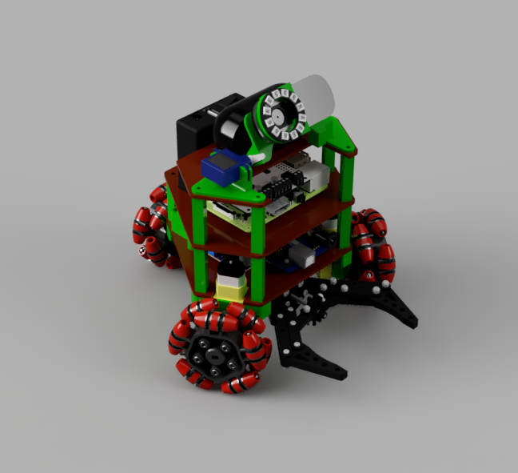
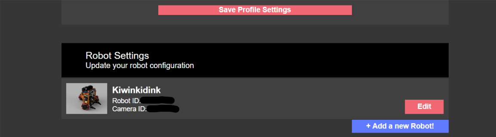
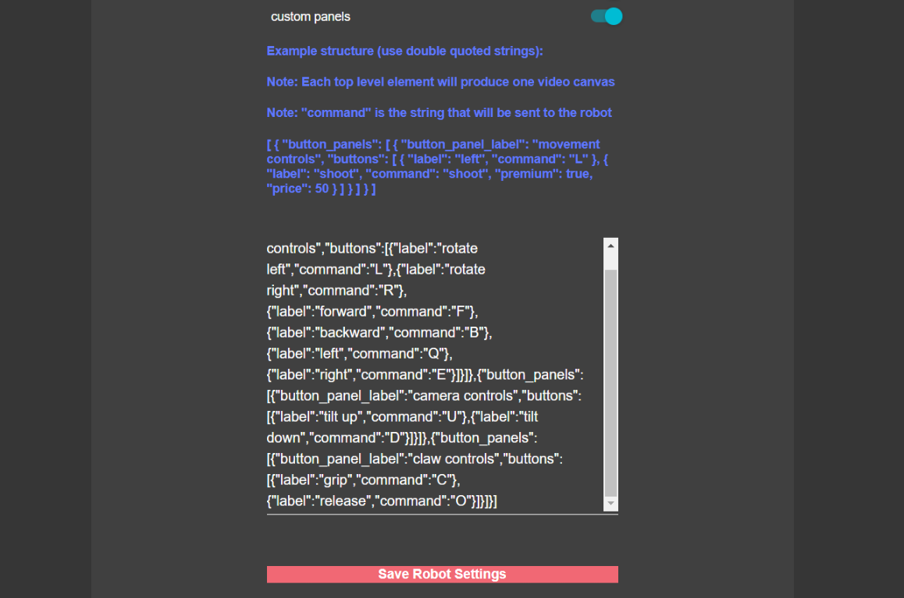

# kiwinkidinkily

Here are my custom scripts for my LetsRobot robot. They are designed to be copied into the letsrobot repository after going through their tutorial.



## Instructions:

1. ### Setup LetsRobot

    Go to the [**letsrobot repository**](https://github.com/letsRobot/letsrobot) and follow the instructions for setting up the raspberry pi and connecting your robot. Make sure you download and install the software for the **Adafruit Motor Hat**.

2. ### Create the Custom Control Panels

    1. Go to the letsrobot.tv website click edit under your robot settings
        
        
    2. Scroll to the bottom of the page and click the switch labeled **custom panels**. This should open a text box. Paste the following and click **Save Robot Settings**.
        ```
        [{"button_panels":[{"button_panel_label":"movement 
        controls","buttons":[{"label":"rotate 
        left","command":"L"},{"label":"rotate 
        right","command":"R"},
        {"label":"forward","command":"F"},
        {"label":"backward","command":"B"},
        {"label":"left","command":"Q"},
        {"label":"right","command":"E"}]}]},{"button_panels":
        [{"button_panel_label":"camera controls","buttons":
        [{"label":"tilt up","command":"U"},{"label":"tilt 
        down","command":"D"}]}]},{"button_panels":
        [{"button_panel_label":"claw controls","buttons":
        [{"label":"grip","command":"C"},
        {"label":"release","command":"O"}]}]}]
        ```
        

3. ### Clone kiwinkidinkily

    1. Make sure your in your home folder
        ```
        cd ~
        ```
    2. Clone this repository
        ```
        git clone https://github.com/zeropt/kiwinkidinkily.git
        ```
        
4. ### Copy the Files into letsrobot
    1. Copy letsrobot.conf
        ```
        cp kiwinkidinkily/letsrobot.conf letsrobot/letsrobot.conf
        ```
    2. Copy motor_hat.py
        ```
        cp kiwinkidinkily/motor_hat.py letsrobot/hardware/motor_hat.py
        ```
        
5. ### Edit letsrobot.conf
    1. From your home directory, type
        ```
        nano letsrobot/letsrobot.conf
        ```
    2. Enter your letsRobot username, RobotID, and CameraID
        ```
        # This is your username on the letsrobot site. This is the user that is allowed
        # to issue commands via chat 
        owner=YourLetsRobotUserName
        
        # Your robots id. The site will provide you with this and the camera id when
        # you create a new robot.
        robot_id=YourRobotID
        
        # Your robots camera id
        camera_id=YourCameraID
        ```
    3. **ctrl**-**x** to exit, type **y** and **enter** to save.
6. ### Reboot
    Reboot and open your robot stream page
    ```
    sudo reboot
    ```
